# Simple Docker

## Part 1. Готовый докер

##### Взять официальный докер образ с **nginx** и выкачать его при помощи `docker pull`
##### Проверить наличие докер образа через `docker images`

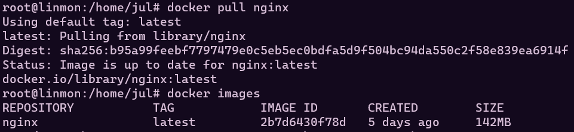

Использование команд `docker pull` `docker images`

##### Запустить докер образ через `docker run -d [image_id|repository]`
##### Проверить, что образ запустился через `docker ps`

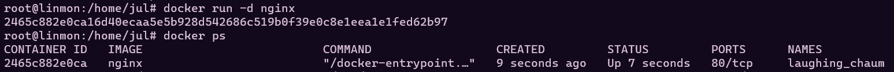

Использование команд `docker run -d nginx` `docker ps`

##### Посмотреть информацию о контейнере через `docker inspect [container_id|container_name]`

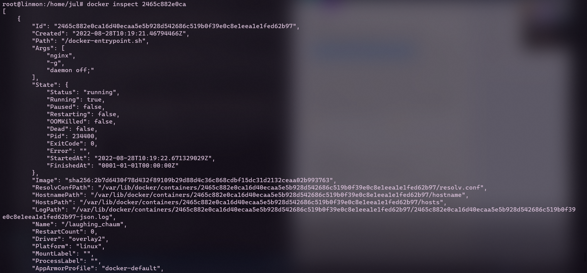
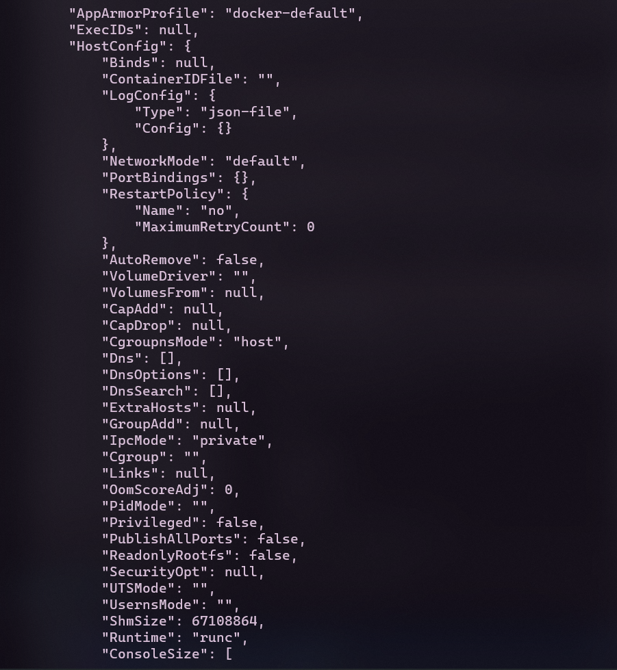
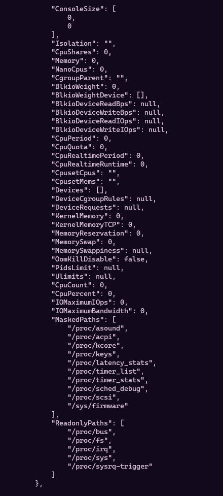
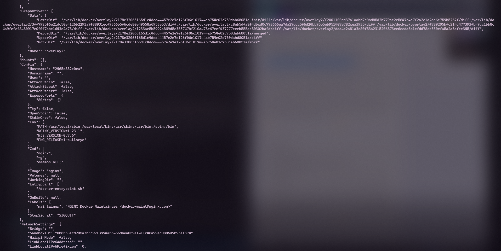
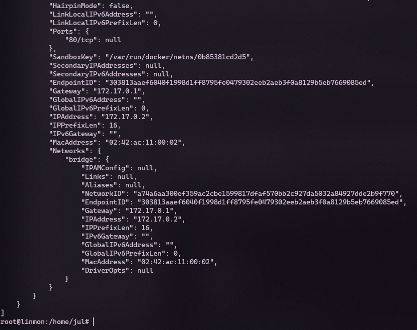

##### По выводу команды определить и поместить в отчёт размер контейнера, список замапленных портов и ip контейнера

- отчёт размер контейнера: 1.09kB (virtual 142MB)
- список замапленных портов: "80/tcp":null
- ip контейнера: 172.17.0.2

##### Остановить докер образ через `docker stop [container_id|container_name]`
##### Проверить, что образ остановился через `docker ps`

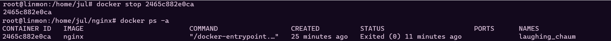

Использование команд `docker stop container_id` `docker ps -a`

##### Запустить докер с замапленными портами 80 и 443 на локальную машину через команду *run*

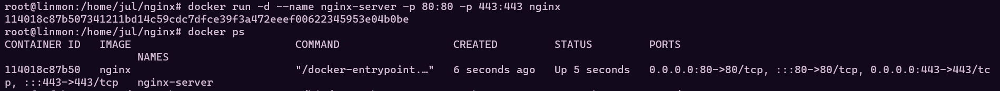

Использование команды `docker run -d --name nginx-server -p 80:80 -p 443:443 nginx`

##### Проверить, что в браузере по адресу *localhost:80* доступна стартовая страница **nginx**

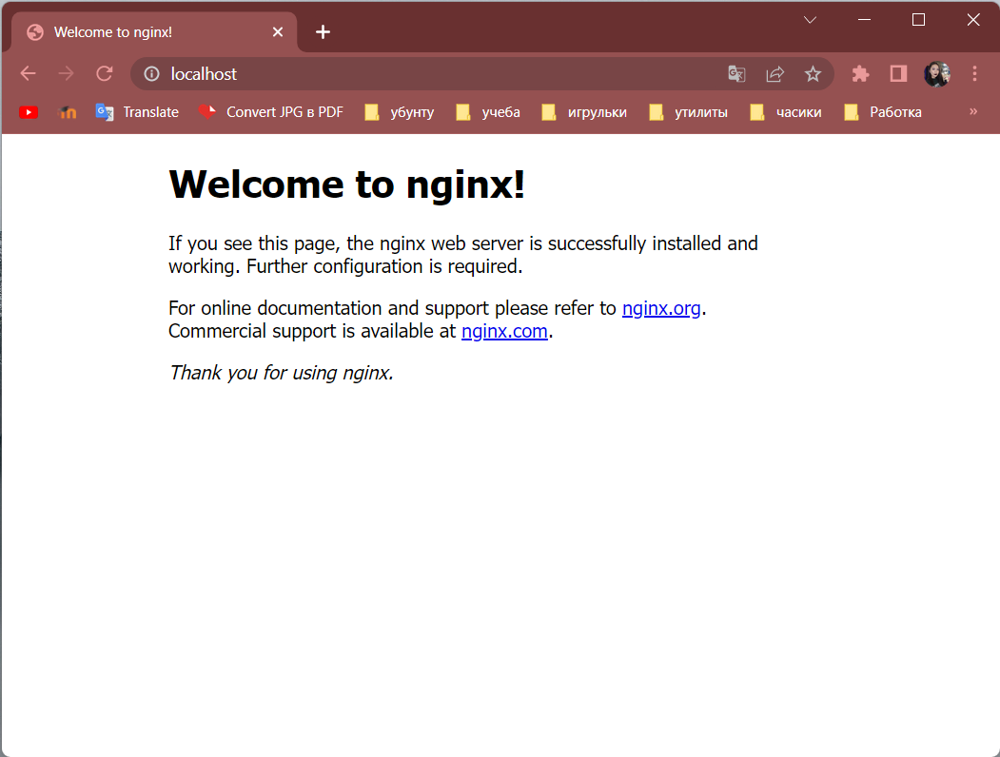

80 - стандартный порт, по адресу localhost:80 открывается стартовая страница nginx.

##### Перезапустить докер контейнер через `docker restart [container_id|container_name]`
##### Проверить любым способом, что контейнер запустился

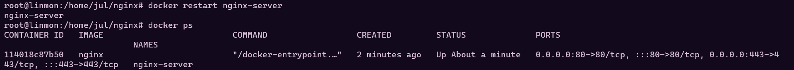

Использование команд `docker restart nginx-server` `docker ps`

## Part 2. Операции с контейнером

##### Прочитать конфигурационный файл *nginx.conf* внутри докер образа через команду *exec*

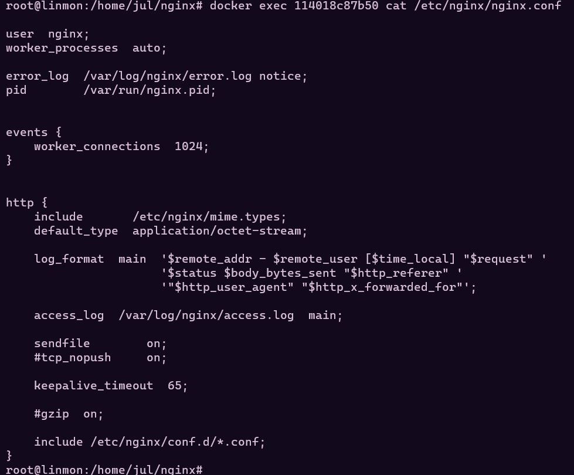

`docker exec container_id cat /etc/nginx/nginx.conf`

##### Создать на локальной машине файл *nginx.conf*

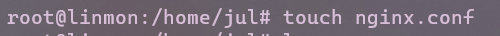

##### Настроить в нем по пути */status* отдачу страницы статуса сервера **nginx**

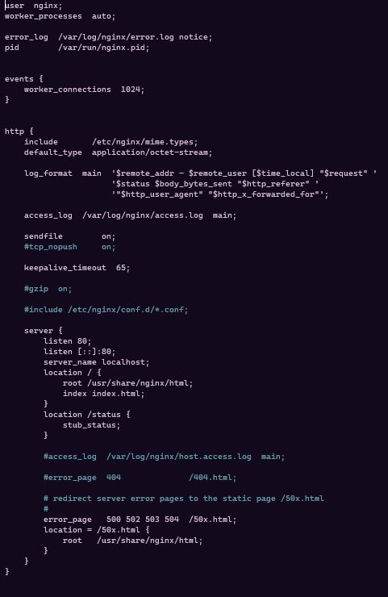

##### Скопировать созданный файл *nginx.conf* внутрь докер образа через команду `docker cp`

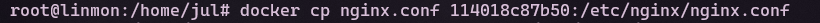

`docker cp nginx.conf container_id:/etc/nginx/nginx.conf`

##### Перезапустить **nginx** внутри докер образа через команду *exec*

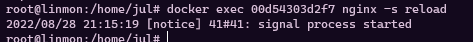

`docker exec container_id nginx -s reload`

##### Проверить, что по адресу *localhost:80/status* отдается страничка со статусом сервера **nginx**

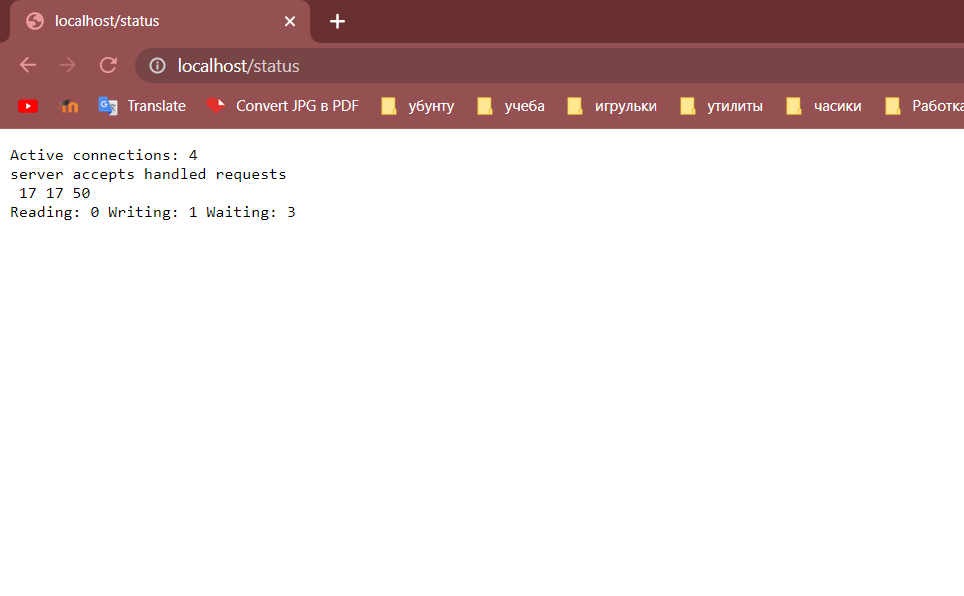

##### Экспортировать контейнер в файл *container.tar* через команду *export*

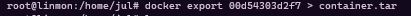

`docker export container_id > container.tar`

##### Остановить контейнер

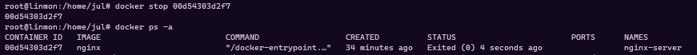

`docker stop container_id`

##### Удалить образ через `docker rmi [image_id|repository]`, не удаляя перед этим контейнеры

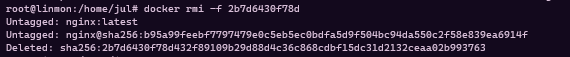

`docker rmi -f image_id`

Флаг -f для принудительного удаления образа без удаления контейнеров

##### Удалить остановленный контейнер

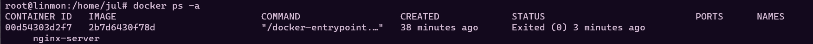

Видно, что образ удалился. Теперь удалим контейнер.

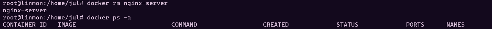

##### Импортировать контейнер обратно через команду *import*

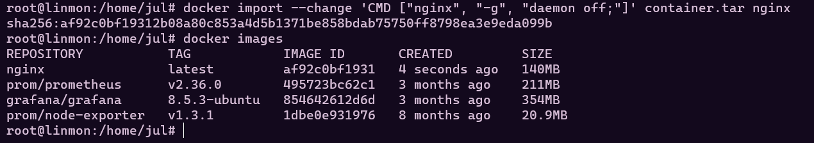

`docker import --change 'CMD ["nginx", "-g", "daemon off;"]' container.tar nginx`

##### Запустить импортированный контейнер

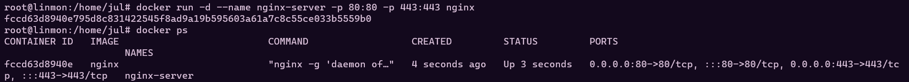

##### Проверить, что по адресу *localhost:80/status* отдается страничка со статусом сервера **nginx**

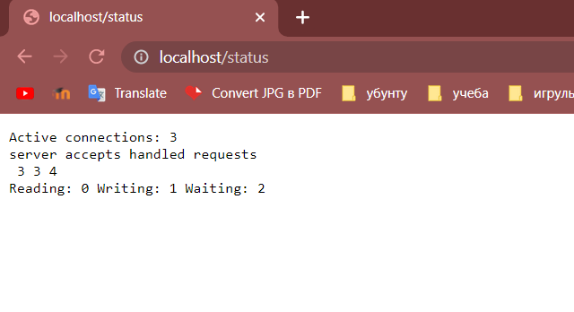
